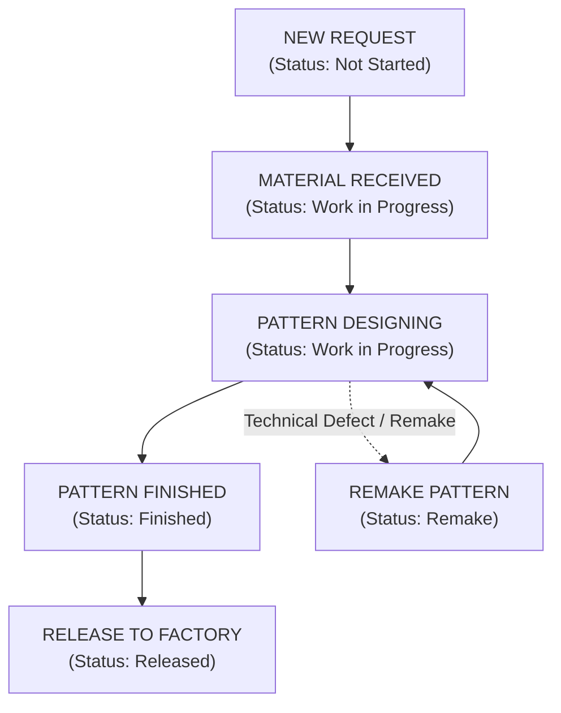

# USER GUIDE
## PATTERN DEVELOPMENT REQUEST MANAGEMENT SYSTEM (TCC TEMPLATE REQUEST)

**TRAXECO GROUP — TCC TEMPLATE DIVISION**  
*Version: 1.4.0 | Last Updated: 2026-06-20*

---

  

    <h2>TABLE OF CONTENTS</h2>
    

    <ul class="toc-list">
      <li>
        <a href="#1-general-business-process">1. General Business Process</a>
        Page 3
      </li>
      <li>
        <a href="#2-tasks-for-requestors">2. Tasks for Requestors</a>
        Page 3
      </li>
      <li class="toc-subitem">
        <a href="#task-21-register-a-new-pattern-request-create-new">• Register a New Pattern Request (Create New)</a>
      </li>
      <li class="toc-subitem">
        <a href="#task-22-track-progress--update-material-sent-date">• Track Progress & Update Material Sent Date</a>
      </li>
      <li>
        <a href="#3-tasks-for-tcc-technical-department-adminpattern-maker">3. Tasks for TCC Technical Department (Admin/Pattern Maker)</a>
        Page 5
      </li>
      <li class="toc-subitem">
        <a href="#task-31-update-progress--assign-pattern-maker">• Update Progress & Assign Pattern Maker</a>
      </li>
      <li class="toc-subitem">
        <a href="#task-32-release-finished-patterns-release">• Release Finished Patterns (Release)</a>
      </li>
      <li>
        <a href="#4-performance-monitoring-and-analytics-dashboard">4. Performance Monitoring and Analytics (Dashboard)</a>
        Page 6
      </li>
      <li>
        <a href="#5-advanced-features--help">5. Advanced Features & Help</a>
        Page 8
      </li>
    </ul>
  

## 1. General Business Process

The system manages the state of each pattern development request according to the following workflow:

## 2. Tasks for Requestors

### Task 2.1: Register a New Pattern Request (Create New)

To send a new pattern development request to the TCC technical department, follow these steps:

1. **Access the Request Page**: From the left navigation menu, click **Template Request**.  
   
2. **Open the Registration Form**: Click **Add New** at the top right of the screen. The registration form drawer will slide in from the right.  
   
3. **Select Customer & Enter General Info**:
   * Select **Customer** from the dropdown suggestions:  
     
   * Enter **Season** information (e.g., *SS26*, *FW26*):  
     
   * Enter **Style No** exactly as specified in the style tech pack:  
     
   * Enter **Product Type** (e.g., *Jacket*, *Pants*):  
     
4. **Enter Technical Details**:
   * Select **Sample Stage** (e.g., *01 - 1st Proto*, *07 - Size Set*):  
     
   * Select the target **Factory** for sample manufacturing:  
     
   * Select the date materials are sent using the datepicker at **Material Sent Date**:  
     
   * Select the process complexity at **Process Type**:  
     
5. **Configure Machine & Size parameters**:
   * Enter a detailed **Operation Description**:  
     
   * Fill in the **Machine Type** to be used:  
     
   * Fill in the **Machine Dimension**:  
     
   * Fill in the **Sizes Required** (e.g., *S, M, L*):  
     
   * Enter the **Line Quantity** (number of pattern pieces requested):  
     
   * Select the requested **Expected Delivery Date**:  
     
6. **Handle Urgent Requests (Priority)**:
   * If the request is urgent, set **Is Priority** to Yes:  
     
   * Once set to Yes, it is mandatory to specify a clear **Priority Reason** in the input field that appears below:  
     
7. **Submit Request**: Click **Submit** at the bottom of the drawer. The request will appear instantly on the tracking grid.  
   

---

### Task 2.2: Track Progress & Update Material Sent Date

1. **Search for Style No**: Enter the customer name in the quick search bar, or use the filter buttons to narrow down the tracking list:  
   
   * Click **Filter** or **Load Data** to retrieve and filter requests:  
     

       
       
     

   * Click the **Filter** button to slide open the **Advanced Filter** panel on the right side of the screen for multi-criteria filtering:  
     
2. **Monitor Request Status**: Track the **Status** column on the grid to inspect progress made by the TCC technical team:  
   
3. **Quick Edit Material Sent Date**:
   * Hover over the row you want to update and double-click or click the edit pencil icon in the **Material Sent Date** column cell:  
     
   * A datepicker dialog will pop up. Choose the correct sent date and click Save to apply changes directly on the grid:  
     

> [!NOTE]
> The inline quick-edit functionality for Material Sent Date is only available if your user account is authorized with editing permissions.

## 3. Tasks for TCC Technical Department (Admin/Pattern Maker)

### Task 3.1: Update Progress & Assign Pattern Maker

Upon receiving sample materials or assigning a technician to create the pattern, follow these steps:

1. **Access the Master Data Page**: From the left navigation menu, click **Master Data**.  
   
2. **Open the Detail View Drawer**: Double-click the request row on the grid. The detail view drawer will slide in from the right. The left panel shows the original request information submitted by requestors in read-only format:  
   
3. **Update Material Receipt Info**:
   * Select the **Material Received Date** using the calendar picker tool:  
     
   * Select the technician assigned to design the pattern in the **Developer Name** field:  
     
4. **Update Status & Working Dates**:
   * When beginning the design process: Change **Status** to **Work in Progress**:  
     
     Also select the actual **Start Date**:  
     
   * When pattern design is complete: Change status to **Finished** and select the actual **Finished Date**:  
     
     It is also mandatory to enter the number of designed pattern pieces in the **Template Qty** field:  
     
5. **Log Delay or Remake Reasons**:
   * If the actual finished date is past the requested expected delivery date, it is mandatory to specify or choose a reason in the **Delay/Remake Reason** field:  
     
   * Log any extra information or remarks in the **Remarks** field:  
     
6. **Save Progress**: Click **Save** at the bottom of the form.  
   
   * The system will automatically compute and display the **Last Updated By** and **Last Updated At** audit logs at the bottom left corner of the drawer to record edits:  
     

---

### Task 3.2: Release Finished Patterns (Release)

When pattern drawings have been audited and passed technical checks, and the pattern is handed over to the factory workshops for bulk production:

1. **Open the Detail Drawer** of the request which must be in **Finished** status.
2. **Trigger Pattern Release**: Click **Release** at the bottom right corner of the update form:  
   
3. **Confirm Data Lock**: The system will automatically record the release time in the **Released Date** field and update the request status to **Released**. At this point, the update form will be completely locked (read-only) to protect data integrity.  
   

> [!IMPORTANT]
> Once the **Release** action is executed, the request record is locked permanently. No further modifications are allowed to ensure statistic and tracking reports remain strictly accurate.

## 4. Performance Monitoring and Analytics (Dashboard)

The **Dashboard** page helps managers monitor working efficiency and request processing speeds across the pattern development division in real-time.

1. **Review 8 Performance KPI Cards**: Monitor high-level metrics including total registered requests (Total Input), total finished requests (Total Output), requests currently in process (In Process) or not started (Not Started), patterns flagged for remake due to errors (Remake), the on-time completion percentage (Completion Rate), the average working days required per request (Avg Working Day), and total patterns delivered to workshops (Total Delivery):  
   
2. **Analyze 6 Activity Charts**:
   * **Monthly Input** (Distribution of registered requests per month):  
     
   * **Customer distribution** (Breakdown of request distribution across different brands):  
     
   * The dashboard features 6 dynamically aligned charts reflecting real-time database modifications:
     

       
       
Figure 4.1: High-end charts and KPI dashboards representing pattern maker productivity

     

---

## 5. Advanced Features & Help

* **Real-time Synchronization**: Powered by a robust WebSocket server, any progress updates made by technicians are pushed immediately to all active requestor tracking grids and management dashboards without requiring manual page reloads (F5).
* **Transparent Audit History**: Every request record tracks audit info showing the last user who updated the record and the exact modification timestamp for verification.
* **Account Info & Access Menu**: Users can check security roles, permissions, or execute logout by clicking on their avatar in the top right header:  
   

     
     
Figure 5.1: Account dropdown menu showing logged employee code and permissions

   

---

> [!TIP]
> **Operational Shortcuts:**
> * Instead of clicking the editing icon, double-click any row on the grid list to quickly open its detailed info panel or admin progress drawer.
> * Export the request list instantly to an Excel-compatible spreadsheet (CSV) by clicking the **Export** button at the top left of the grid.
