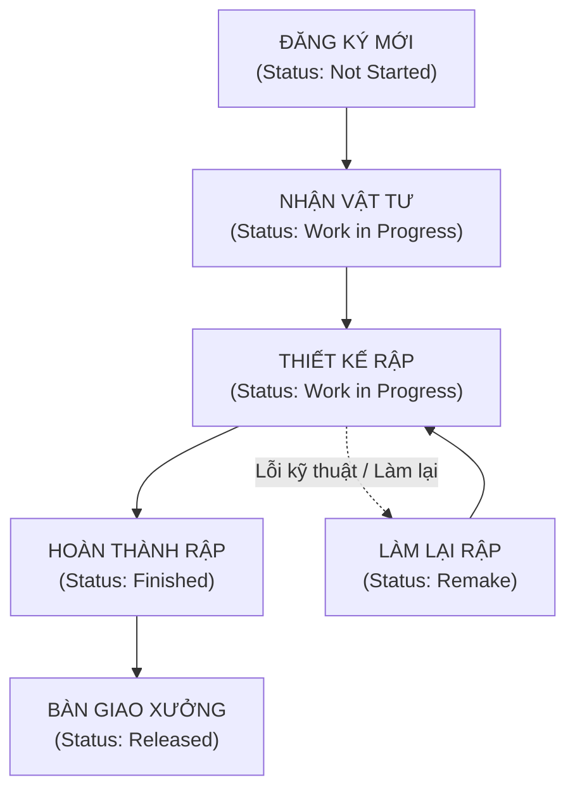

# TÀI LIỆU HƯỚNG DẪN SỬ DỤNG (USER GUIDE)
## HỆ THỐNG QUẢN LÝ YÊU CẦU PHÁT TRIỂN RẬP (TCC TEMPLATE REQUEST)

**TRAXECO GROUP — TCC TEMPLATE DIVISION**  
*Phiên bản: 1.4.0 | Ngày cập nhật: 2026-06-20*

---

  

    <h2>MỤC LỤC</h2>
    

    <ul class="toc-list">
      <li>
        <a href="#1-quy-trình-nghiệp-vụ-tổng-quan">1. Quy trình nghiệp vụ tổng quan</a>
        Trang 3
      </li>
      <li>
        <a href="#2-tác-vụ-dành-cho-người-đăng-ký-requestor">2. Tác vụ dành cho Người đăng ký (Requestor)</a>
        Trang 3
      </li>
      <li class="toc-subitem">
        <a href="#tác-vụ-21-đăng-ký-yêu-cầu-rập-mới-tạo-mới">• Đăng ký yêu cầu rập mới (Tạo mới)</a>
      </li>
      <li class="toc-subitem">
        <a href="#tác-vụ-22-tra-cứu-tiến-độ--cập-nhật-ngày-gửi-vật-tư">• Tra cứu tiến độ & Cập nhật ngày gửi vật tư</a>
      </li>
      <li>
        <a href="#3-tác-vụ-dành-cho-bộ-phận-kỹ-thuật-tcc-admindeveloper">3. Tác vụ dành cho Kỹ thuật TCC (Admin/Pattern Maker)</a>
        Trang 5
      </li>
      <li class="toc-subitem">
        <a href="#tác-vụ-31-cập-nhật-tiến-độ--gán-nhân-viên-thiết-kế-rập-pattern-maker">• Cập nhật tiến độ & Gán nhân viên thiết kế rập</a>
      </li>
      <li class="toc-subitem">
        <a href="#tác-vụ-32-phát-hành-rập-thành-phẩm-release">• Phát hành rập thành phẩm (Release)</a>
      </li>
      <li>
        <a href="#4-theo-dõi-báo-cáo-và-phân-tích-năng-suất-dashboard">4. Theo dõi báo cáo và phân tích năng suất (Dashboard)</a>
        Trang 6
      </li>
      <li>
        <a href="#5-các-tính-năng-nâng-cao-trợ-giúp">5. Các tính năng nâng cao & Trợ giúp</a>
        Trang 8
      </li>
    </ul>
  

## 1. Quy trình nghiệp vụ tổng quan

Hệ thống quản lý trạng thái của mỗi yêu cầu phát triển rập theo sơ đồ sau:

## 2. Tác vụ dành cho Người đăng ký (Requestor)

### Tác vụ 2.1: Đăng ký yêu cầu rập mới (Tạo mới)

Để gửi một yêu cầu làm rập mới đến bộ phận kỹ thuật TCC, hãy thực hiện theo các bước sau:

1. **Truy cập trang Tra cứu**: Từ danh mục tính năng bên trái, nhấp chọn mục **Yêu Cầu Rập** (Template Request).  
   
2. **Mở khung đăng ký**: Nhấn nút **Thêm yêu cầu mới** ở góc phía trên bên phải màn hình. Khung nhập liệu đăng ký sẽ hiển thị ở phía bên phải.  
   
3. **Chọn Khách hàng & nhập thông tin chung**:
   * Chọn **Khách hàng** từ danh sách gợi ý sẵn:  
     
   * Điền thông tin **Mùa (Season)** (ví dụ: *SS26*, *FW26*):  
     
   * Nhập **Mã hàng (Style No)** chính xác theo tài liệu kỹ thuật của đơn hàng:  
     
   * Nhập **Loại sản phẩm (Product Type)** (ví dụ: *Jacket*, *Pants*):  
     
4. **Nhập chi tiết kỹ thuật sản xuất**:
   * Chọn **Giai đoạn mẫu** (ví dụ: *01 - 1st Proto*, *07 - Size Set*):  
     
   * Chọn **Nhà máy** chịu trách nhiệm sản xuất mẫu:  
     
   * Chọn ngày gửi mẫu bằng công cụ chọn ngày tại ô **Ngày gửi vật tư (Material Sent Date)**:  
     
   * Chọn độ phức tạp của quy trình tại ô **Quy trình đơn giản/ phức tạp**:  
     
5. **Cấu hình thông số máy & Kích thước**:
   * Nhập **Mô tả hoạt động** chi tiết:  
     
   * Điền **Loại máy sử dụng**:  
     
   * Điền **Kích thước máy**:  
     
   * Điền **Size mẫu** yêu cầu (ví dụ: *S, M, L*):  
     
   * Nhập **Số lượng rập yêu cầu**:  
     
   * Chọn **Ngày dự kiến hoàn thành** mong muốn:  
     
6. **Xử lý yêu cầu làm gấp (Ưu tiên)**:
   * Nếu yêu cầu cần làm gấp, chọn **Yêu cầu ưu tiên** thành Có (Yes):  
     
   * Khi chọn Có, bắt buộc phải điền rõ **Lý do ưu tiên** vào khung nhập liệu xuất hiện phía dưới:  
     
7. **Gửi yêu cầu**: Nhấn nút **Gửi** ở cuối khung. Yêu cầu mới sẽ hiển thị lập tức trên bảng danh sách.  
   

---

### Tác vụ 2.2: Tra cứu tiến độ & Cập nhật ngày gửi vật tư

1. **Tìm kiếm mã hàng**: Nhập tên khách hàng vào ô tìm kiếm nhanh, hoặc sử dụng các nút bộ lọc để khoanh vùng dữ liệu:  
   
   * Sử dụng nút **Bộ lọc** và **Tải dữ liệu** để lọc thông tin nhanh chóng:  
     

       
       
     

   * Nhấp chọn nút **Bộ lọc** để mở ngăn chứa **Bộ lọc nâng cao** bên phải màn hình khi cần lọc chi tiết theo nhiều tiêu chí:  
     
2. **Kiểm tra trạng thái**: Theo dõi cột **Trạng thái (Status)** trên bảng theo dõi để kiểm tra tiến trình thực hiện của bộ phận kỹ thuật:  
   
3. **Sửa nhanh Ngày gửi vật tư**:
   * Di chuyển con trỏ chuột đến dòng mã hàng cần cập nhật, nhấp đúp hoặc nhấp vào biểu tượng chỉnh sửa hình bút chì tại ô **Ngày gửi vật tư**:  
     
   * Hộp thoại lịch sẽ xuất hiện để bạn chọn ngày gửi vật tư mới. Sau khi chọn, nhấn Lưu để hoàn thành cập nhật trực tiếp trên bảng:  
     

> [!NOTE]
> Tính năng sửa nhanh Ngày gửi vật tư trên bảng theo dõi chỉ khả dụng khi tài khoản đăng nhập của bạn được cấp quyền chỉnh sửa tương ứng.

## 3. Tác vụ dành cho Bộ phận Kỹ thuật TCC (Admin/Pattern Maker)

### Tác vụ 3.1: Cập nhật tiến độ & Gán nhân viên thiết kế rập

Khi nhận được vật tư mẫu hoặc phân công nhân viên chịu trách nhiệm vẽ rập thiết kế, hãy làm theo các bước sau:

1. **Truy cập trang Quản lý**: Từ danh mục tính năng bên trái, chọn mục **Dữ Liệu Gốc** (Master Data).  
   
2. **Mở khung thông tin chi tiết**: Nhấp đúp vào dòng yêu cầu cần cập nhật tiến độ trên bảng danh sách. Ngăn thông tin chi tiết sẽ hiển thị ở phía bên phải. Phần bên trái là các thông tin ban đầu do người đăng ký gửi lên ở dạng chỉ đọc để đối chiếu:  
   
3. **Cập nhật thông tin tiếp nhận vật tư**:
   * Nhấp chọn ô **Ngày nhận vật tư thực tế** (Material Received Date) bằng công cụ chọn ngày:  
     
   * Chọn tên kỹ thuật viên chịu trách nhiệm thiết kế rập mẫu tại ô **Nhân viên thiết kế** (Developer Name):  
     
4. **Cập nhật Trạng thái & Ngày thực hiện thực tế**:
   * Khi bắt đầu triển khai vẽ rập: Chuyển trạng thái sang **Work in Progress** tại ô Trạng thái (Status):  
     
     Đồng thời chọn **Ngày bắt đầu** thực tế:  
     
   * Khi thiết kế xong bản vẽ rập: Chọn trạng thái **Finished** và cập nhật **Ngày kết thúc** thực tế:  
     
     Đồng thời bắt buộc phải nhập số lượng chi tiết thiết kế vào ô **Số lượng rập** (Template Qty):  
     
5. **Ghi nhận lý do trễ tiến độ hoặc làm lại**:
   * Nếu thời gian hoàn thành thực tế bị muộn so với yêu cầu ban đầu, bắt buộc phải chọn hoặc điền thông tin vào ô **Lý do trễ/Lý do làm lại**:  
     
   * Ghi nhận thêm thông tin bổ sung tại ô **Ghi chú**:  
     
6. **Lưu tiến độ**: Nhấn nút **Lưu** ở cuối khung thông tin.  
   
   * Hệ thống sẽ tự động cập nhật và hiển thị thông tin **Người cập nhật cuối** cùng **Thời gian cập nhật cuối** ở góc dưới cùng bên trái của khung chi tiết yêu cầu để theo dõi lịch sử chỉnh sửa:  
     

---

### Tác vụ 3.2: Phát hành rập thành phẩm (Release)

Khi bản vẽ thiết kế rập đã được kiểm tra đạt yêu cầu kỹ thuật và tiến hành bàn giao thực tế xuống nhà xưởng để sản xuất đại trà:

1. **Mở khung chi tiết** của dòng yêu cầu rập đang ở trạng thái **Finished**.
2. **Kích hoạt phát hành rập**: Nhấp chọn nút **Release** ở góc dưới bên phải khung cập nhật thông tin:  
   
3. **Xác nhận khóa thông tin**: Hệ thống sẽ ghi nhận thời điểm phát hành vào ô **Ngày phát hành** (Released Date) và chuyển trạng thái yêu cầu sang **Released**. Đồng thời, toàn bộ biểu mẫu cập nhật sẽ bị khóa (chuyển sang chỉ đọc) để bảo vệ tính chính xác của dữ liệu sản xuất.  
   

> [!IMPORTANT]
> Sau khi đã nhấn nút **Release** phát hành rập, toàn bộ dữ liệu của yêu cầu đó sẽ bị khóa hoàn toàn. Không ai có quyền chỉnh sửa thêm để phục vụ mục tiêu thống kê chính xác.

## 4. Theo dõi báo cáo và phân tích năng suất (Dashboard)

Màn hình **Thống Kê** giúp người quản lý theo dõi nhanh hiệu năng làm việc và tiến độ tổng quan của bộ phận phát triển rập.

1. **Xem 8 Thẻ chỉ số năng suất (KPIs)**: Theo dõi trực tiếp các chỉ số như tổng yêu cầu đăng ký (Total Input), tổng yêu cầu hoàn thành (Total Output), các yêu cầu đang thực hiện (In Process) hoặc chưa bắt đầu (Not Started), lượng rập bị lỗi cần sửa đổi (Remake), tỉ lệ hoàn thành đúng hạn (Completion Rate), số ngày phát triển trung bình (Avg Working Day) và tổng sản lượng bàn giao thực tế xuống nhà xưởng (Total Delivery):  
   
2. **Phân tích 6 biểu đồ hoạt động**:
   * **Monthly Input** (Lượng yêu cầu theo từng tháng):  
     
   * **Customer distribution** (Cơ cấu tỉ lệ yêu cầu theo khách hàng thương hiệu):  
     
   * Xem đầy đủ giao diện trang thống kê với lưới bố cục 6 biểu đồ đồng bộ số liệu tự động theo thời gian thực:
     

       
       
Hình 4.1: Giao diện biểu đồ phân tích hiệu suất năng suất trên trang Thống Kê

     

---

## 5. Các tính năng nâng cao & Trợ giúp

* **Hệ thống tự động đồng bộ dữ liệu thời gian thực**: Nhờ công nghệ đồng bộ ngầm, bất kỳ thông tin nào được cập nhật từ kỹ thuật viên vẽ rập sẽ hiển thị ngay tức thì trên bảng tra cứu tiến độ của người đăng ký và các báo cáo thống kê của quản lý mà không cần tải lại trang (F5).
* **Lịch sử cập nhật minh bạch**: Mọi lượt chỉnh sửa tiến độ đều tự động ghi nhận mã nhân viên cập nhật cuối cùng và thời gian thực thi tại chân trang chi tiết yêu cầu để làm căn cứ hậu kiểm.
* **Thông tin tài khoản đăng nhập**: Người dùng có thể kiểm tra vai trò, quyền hạn của mình hoặc thực hiện Đăng xuất bằng cách nhấp chọn Avatar tài khoản ở góc trên bên phải màn hình:  
   

     
     
Hình 5.1: Menu tài khoản hiển thị chi tiết mã nhân viên và vai trò bảo mật

   

---

> [!TIP]
> **Mẹo thao tác nhanh (Quick Shortcuts):**
> * Thay vì nhấp vào biểu tượng chỉnh sửa hình bút chì, bạn có thể nhấp đúp trực tiếp vào bất kỳ dòng dữ liệu nào trên bảng danh sách để mở nhanh khung chi tiết yêu cầu tương ứng.
> * Bạn có thể xuất nhanh báo cáo danh sách yêu cầu rập đang hiển thị ra tệp dữ liệu Excel (CSV) bằng cách nhấp vào nút **Export** ở đầu bảng.
